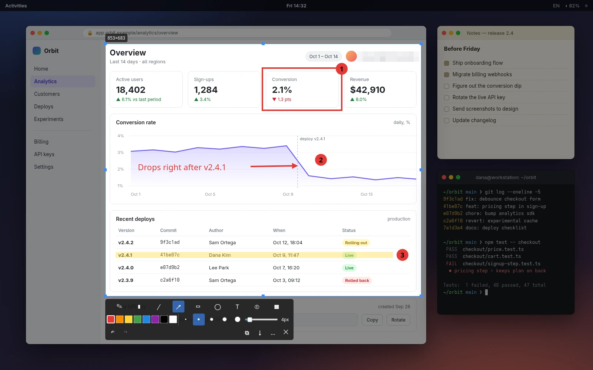
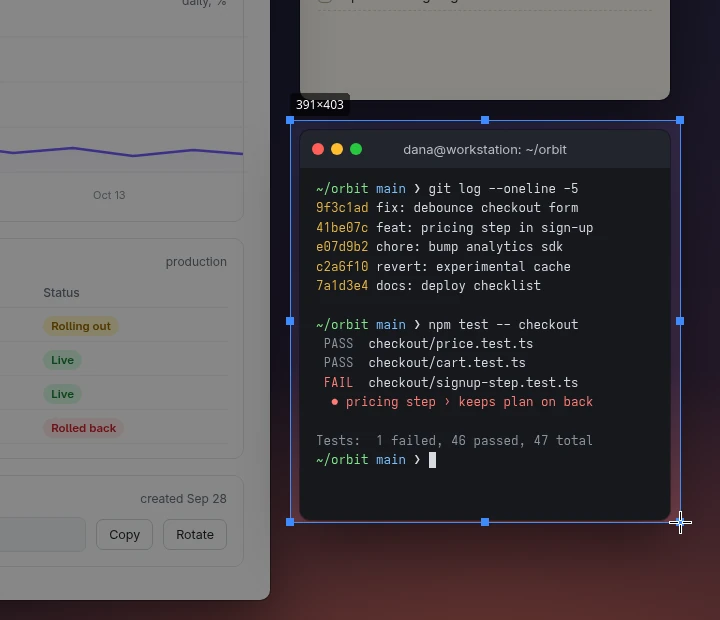
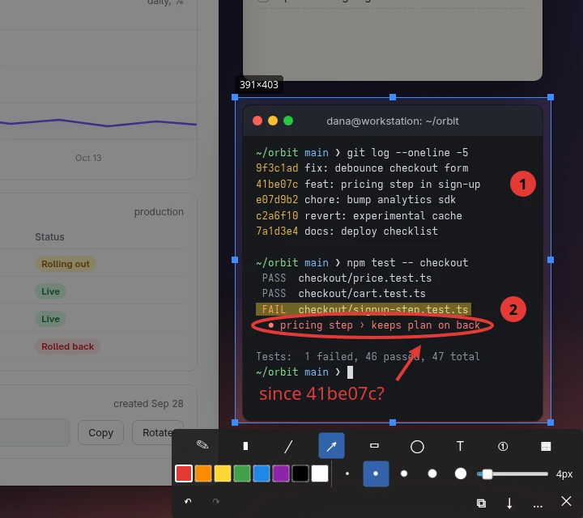
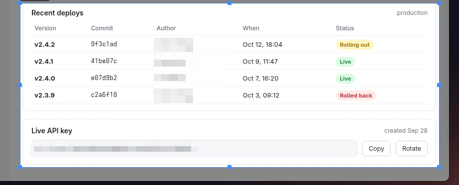

<h1 align="center">
   pinch
</h1>

<p align="center">
  <strong>Select. Mark up. Paste.</strong><br />
  A small, fast screenshot tool for Linux.<br />
  Grab an area, point at what matters and paste it anywhere.
</p>

<p align="center">
  <a href="#install">Install</a> &nbsp; | &nbsp;
  <a href="#features">Features</a> &nbsp; | &nbsp;
  <a href="#keys">Keys</a><br />
  <sub>X11 and Wayland &nbsp; | &nbsp; Multiple monitors &nbsp; | &nbsp; English and Russian &nbsp; | &nbsp; MIT</sub>
</p>

<p align="center">
  <kbd> GNOME</kbd> &nbsp;
  <kbd> KDE Plasma</kbd> &nbsp;
  <kbd> Hyprland</kbd> &nbsp;
  <kbd> Sway</kbd> &nbsp;
  <kbd> X11</kbd>
</p>

pinch takes a screenshot the moment you press its hotkey. Drag over the part you
need and the pen is already in your hand: add arrows, boxes, numbered steps or a
note, pixelate anything private, then press **Ctrl+C**. Inspired by Flameshot,
written from scratch as a small C++/Qt 6 codebase.

On Wayland pinch captures through the compositor itself: **KWin** on KDE Plasma,
**wlr-screencopy** on Hyprland and Sway. GNOME goes through the desktop portal,
which is also the fallback everywhere else.

<p align="center">
  
</p>

## Features

<table>
  <tr>
    <td width="42%" valign="middle">
      <h3>Select in one motion</h3>
      <p>Press the hotkey and drag. A click takes the whole monitor, <b>Ctrl+A</b> takes all of them. The size is shown as you go; drag the handles or press <b>V</b> to move and resize.</p>
    </td>
    <td width="58%">
      <a href="docs/assets/readme/select.webp"></a>
    </td>
  </tr>
  <tr>
    <td valign="middle">
      <h3>Mark it up without hunting for tools</h3>
      <p>Pen, marker, line, arrow, box, ellipse, text and numbered steps are one key away. Hold <b>Shift</b> for straight lines and perfect shapes, press <b>1–5</b> or scroll for thickness, <b>Ctrl+Z</b> to undo.</p>
    </td>
    <td>
      <a href="docs/assets/readme/annotate.webp"></a>
    </td>
  </tr>
  <tr>
    <td valign="middle">
      <h3>Hide what shouldn't leave your screen</h3>
      <p>Pixelate tokens, e-mails and names with <b>B</b> before you share. pinch has no network code, and saved files are readable only by you.</p>
    </td>
    <td>
      <a href="docs/assets/readme/privacy.webp"></a>
    </td>
  </tr>
</table>

**Ctrl+C** or **Enter** copies the selection with your drawings. **Ctrl+S** saves a
PNG to `~/Pictures/Screenshots`, **Ctrl+Shift+S** asks where. After copying, pinch
stays in the background only until something else takes the clipboard.

## Install

Packages for **Arch Linux** and **Ubuntu 24.04 / 26.04** are on the
[releases page](https://github.com/ufna/pinch/releases/latest). Download the one for your system, then:

```bash
sudo pacman -U pinch-*-x86_64.pkg.tar.zst            # Arch
sudo apt install ./pinch_*_ubuntu24.04_amd64.deb     # Ubuntu 24.04 (26.04: the ubuntu26.04 file)
```

They install `/usr/bin/pinch`, the icon and a menu entry. On Arch you can also build the package
yourself with `makepkg -si` in `packaging/arch`.

### Build from source

Ubuntu / Debian:

```bash
sudo apt install qt6-base-dev qt6-wayland qt6-tools-dev qt6-l10n-tools libwayland-dev libwayland-bin pkg-config cmake g++
```

Arch:

```bash
sudo pacman -S qt6-base qt6-wayland qt6-tools wayland cmake gcc noto-fonts
```

Build and install:

```bash
cmake -S . -B build -DCMAKE_BUILD_TYPE=RelWithDebInfo
cmake --build build -j
cmake --install build --prefix ~/.local
```

This installs `~/.local/bin/pinch`, the icon and a menu entry. If a newer compiler stops the build on warnings,
add `-DPINCH_WERROR=OFF` to the first command.

### Hotkey

pinch takes a screenshot when it starts, so bind it to a key. The examples use `/usr/bin/pinch` from a package;
after a source install it is `~/.local/bin/pinch`.

- **GNOME:** Settings → Keyboard → Custom Shortcuts. If you already have a custom shortcut,
  `scripts/set-gnome-shortcut.sh /usr/bin/pinch` points the first one at pinch.
- **KDE Plasma:** System Settings → Keyboard → Shortcuts → Add New → Application → pinch.
- **Hyprland:** `bind = SUPER SHIFT, S, exec, /usr/bin/pinch`
- **Sway:** `bindsym $mod+Shift+s exec /usr/bin/pinch`

## Keys

| Key | Action |
|---|---|
| Mouse | Select an area; click = whole monitor |
| Ctrl+A | Select all monitors |
| P M L A R E T N B | Pen, marker, line, arrow, rectangle, ellipse, text, number, pixelate |
| V | Move / resize the selection (drag outside it to start a new one) |
| Shift while drawing | 45° lines, squares and circles |
| 1 – 5 | Line width presets; mouse wheel changes it by 1 |
| Ctrl+Z / Ctrl+Shift+Z | Undo / redo |
| Ctrl+C or Enter | Copy to clipboard |
| Ctrl+S | Save to ~/Pictures/Screenshots |
| Ctrl+Shift+S | Save as… |
| Esc | Finish text / close |

Hotkeys work in any keyboard layout. The interface follows the system language (English or Russian).

## Notes

- **KDE:** run the installed `pinch` (from a package or `cmake --install`); otherwise screenshots go through the slower portal.
- **GNOME:** the first screenshot may need permission: Settings → Apps → pinch → Screenshots.
- If capturing fails, pinch shows the reason. You can force a method:
  `PINCH_CAPTURE=x11|screencopy|kwin|portal pinch`.
- Pixelation averages blocks of 12 px or more, but text in a known font can sometimes be recovered from it.
  Don't rely on it for passwords.

[MIT](LICENSE)

<sub>Screenshots show the real pinch overlay over a synthetic desktop.</sub>
